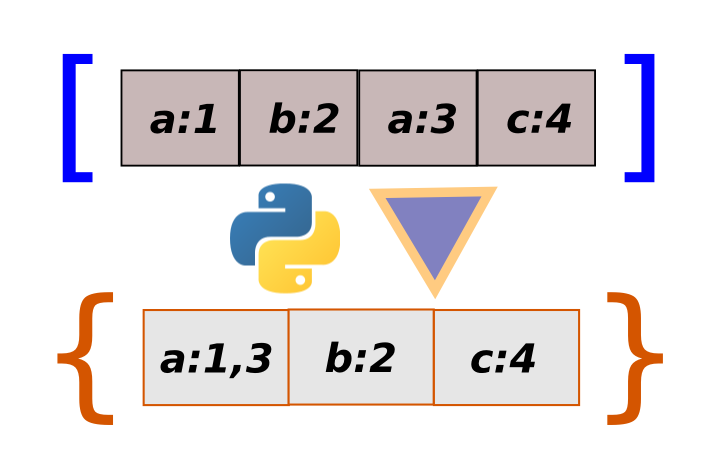

## Day02

## types of dictionary

1. default dictionary

```
[['ravi',101], ['ramu',102],['ravi',103], ['ramu',1024]]
  ----   ---    ----   ---    ---   ---      ---    ---
    0     1       0     1     0      1        0      1
    -------      --------    ----------       --------
      0              1         2                3
```
methods:
-------
'ChainMap', 'Counter', 'OrderedDict', 'UserDict', 'UserList', 'UserString', 'abc', 'defaultdict', 'deque', 'heapq', 'namedtuple

2. ordered dictionary
```
[(4,400),(2,200),(3,300),(4,400)]
  -- --   --  -  -- --    - ---
   0  1   0   1   0  1    0   1
   ----  ------   -----   ------
     0     1         2      3
```
methods:
--------
'pop', 'popitem', 'setdefault', 'update', 'values', 'items', 'keys', 'move_to_end'

3. deque
4. queue
5. named tuple
6. counter

### common datasturctures
1. array
2. linked list
3. stack
4. queue
5. tree
6. graph
